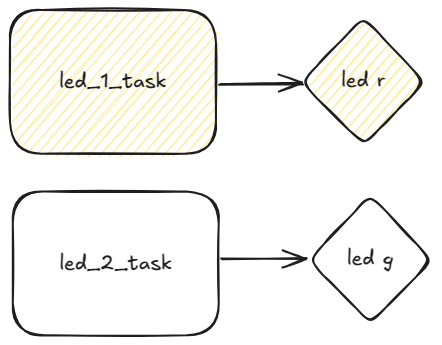

# EXE 1

> Objetivo: Criar tasks

O código fornecido cria uma `task` para o LED R e faz ele piscar usando `vTaskDelay`, faça algo similar agora para o LED G. **Você deve criar uma nova `task` para controlar o LED G**.
