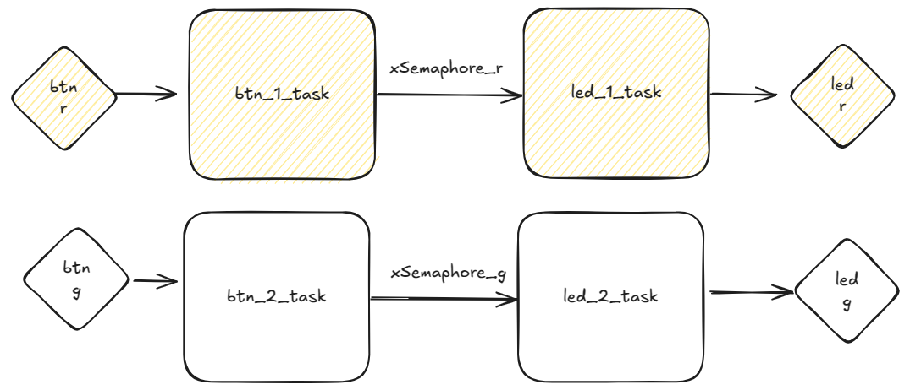

# EXE 2

- Arquivo: `exe2/main.c`
- Teste: Verifica os pinos dos LEDs

> Objetivo: Trabalhar com semáforos entre `tasks`

O código fornecido possui duas `tasks`, uma para acender e apagar o LED R e outra que fica fazendo a leitura do BTN R, sempre que a `btn_1_task` identifica que o botão foi apertado e solto, ela libera a `led_1_task` via o semáforo `xSemaphore_r` para executar.

Faça algo similar para o BTN G e LED G, ao final você deve ter duas novas `tasks`: `btn_2_task`, `led_2_task` e um novo semáforo.
