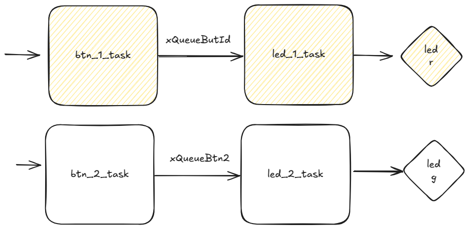

# EXE 3

- Arquivo: `exe3/main.c`
- Teste: Verifica os pinos dos LEDs

> Objetivo: Trabalhar com filas entre `tasks`

O código fornecido possui duas `tasks`, uma para acender e apagar o LED R e outra que fica fazendo a leitura do BTN R, sempre que a `btn_1_task` identifica que o botão foi apertado e solto é enviado um valor `delay` da `btn_1_task` para a `led_1_task` via a fila `xQueueButId`, que usa esse valor para definir a frequência que o LED R vai piscar (via o uso de um semáforo).

Faça algo similar para o BTN G e LED G, ao final você deve ter duas novas `tasks`: `btn_2_task` e `led_2_task` e uma nova fila.
