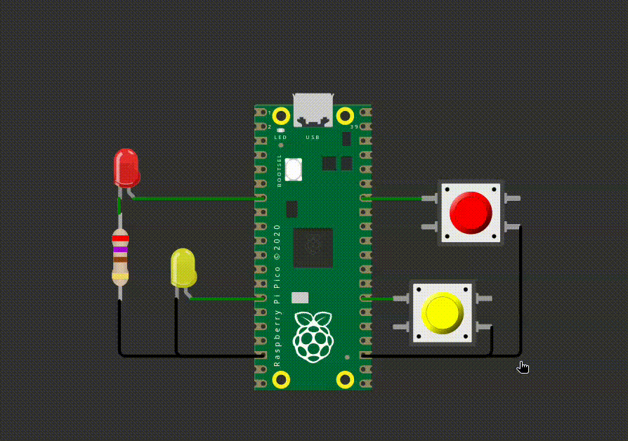
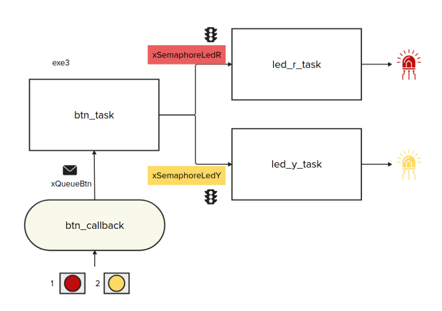

# EXE5

> Exercício de prova!

Neste exercício vocês vão utilizar o RTOS para fazer dois LEDs piscarem. Os leds comecam piscar quando o respectivo botão for apertado e param de piscar quando eles forem apertados novamente.

**Detalhes de funcionalidade:**

- Ao apertar o botão vermelho, o LED vermelho comeca piscar
    - Se apertar novamente o LED vermelho para de piscar e fica apagado

- Ao apertar o botão amarelo, o LED amarelo comeca piscar
    - Se apertar novamente o LED amarelo para de piscar e fica apagado

**Detalhes do firmware:**

- Utulizar RTOS.
- Seguir estrutura proposta do firmware.
- Utilizar delay de 100 ms para piscar os LEDs.
- Deve trabalhar com interrupções nos botões.  
- Não é permitido usar:
    - `sleep_ms(), sleep_us()`.
    - Qualquer variável global que não recursos do RTOS (fila e semáforo)
- **printf** pode atrapalhar o tempo de simulação, comenta antes de testar.
